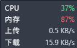
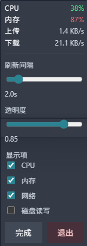

# rmo

一个基于 Rust、Tauri 与原生 HTML/CSS/JavaScript 的 Windows 悬浮系统监控工具，提供 CPU、内存、网络与磁盘读写的实时展示、右键配置和托盘常驻能力。

## 功能特性

- 右下角悬浮显示 CPU、内存、网络上传下载、磁盘读写
- 无边框、置顶、小尺寸悬浮窗
- 启动时自动显示悬浮窗，并在系统托盘常驻
- 悬浮窗右键打开配置面板，可调整刷新间隔、透明度和显示项
- 托盘右键菜单仅保留退出入口
- 窗口不出现在任务栏，只保留托盘图标
- 配置自动持久化到本地配置文件

面板截图：



弹出菜单截图：



## 技术栈

- Rust
- Tauri 2
- sysinfo
- 原生 HTML / CSS / JavaScript

## 项目结构

- `src-tauri`  
  Rust 后端与 Tauri 桌面壳，负责窗口控制、托盘、配置读写和系统指标采集。
- `src`  
  原生前端界面，负责悬浮窗渲染、右键配置面板和前端交互。
- `tests`  
  轻量 UI 结构检查脚本。
- `docs`  
  方案与设计文档。

## 开发运行

安装 Rust 工具链后，在项目根目录执行：

```powershell
cd src-tauri
cargo tauri dev
```

如果只想验证 Rust 侧编译与测试：

```powershell
cd src-tauri
cargo check
cargo test
```

如果只想跑当前的 UI 结构检查：

```powershell
node tests/ui-shell-check.mjs
```

## 配置说明

配置文件默认保存在：

```text
%APPDATA%\rmo\config.json
```

当前配置项包括：

- `refresh_interval_secs`
- `opacity`
- `show_cpu`
- `show_memory`
- `show_network`
- `show_disk_io`

## 当前说明

- 当前目标平台为 Windows
- 前端未引入 Vue、React 等额外框架
- 悬浮窗首次显示前会先按内容完成尺寸同步，以减少启动时的留白感
